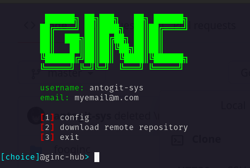
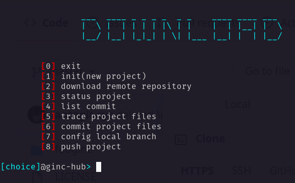
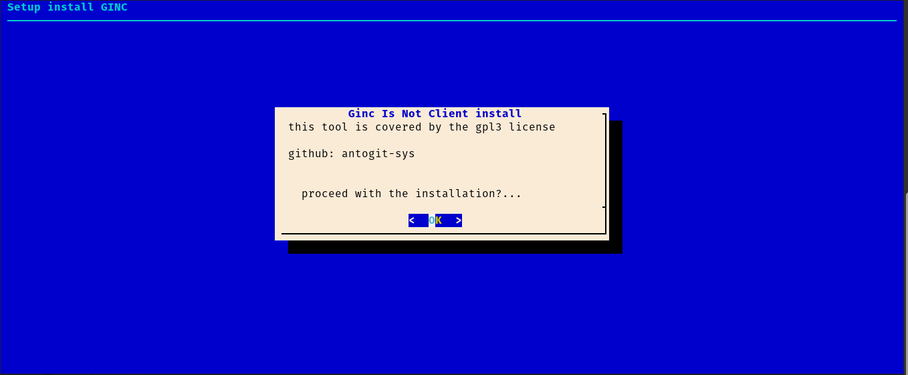
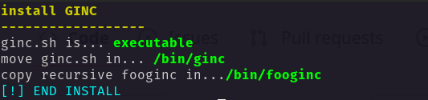
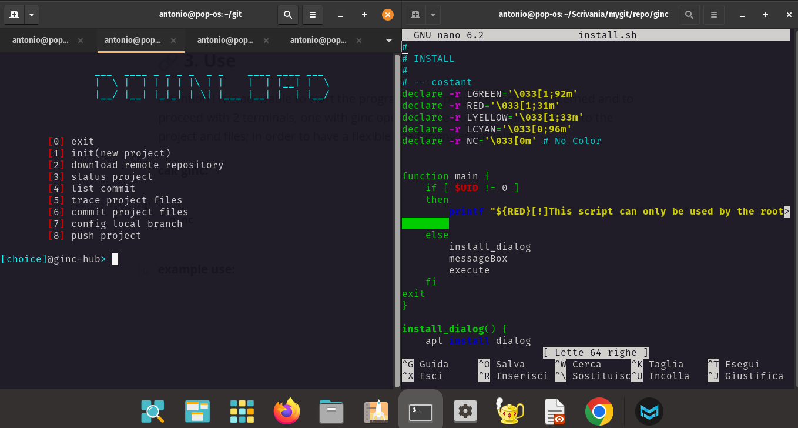

<h1 align = "center"> GINC <h1>

<p align="center">
    
</p>
<p align="center"> 
    <b>ginc is not client</b>
 </p>

## 1. Introduction

<p>
Ginc, which stands for "ginc is not client," is a Bash script designed to simplify and automate the use of Git, the most popular version control system in the world. With ginc, developers can quickly perform common operations like committing changes and syncing with the remote repository. In addition, ginc offers a range of advanced features, such as the ability to run custom commands before and after a commit and display commit logs in an easily readable format. Ginc has been designed with an intuitive user interface and an elegant code structure, making it easy to use and customize for projects of any size. The project is open-source and available on GitHub, where developers can collaborate and contribute to the ongoing improvement of ginc.
</p>

<p>
    
</p>

<br>

##  2. install guide

```bash
sudo bash install.sh
```

<p>
    
</p>

<p>press the enter</p>

<p>
    
</p>

<br>

## 3. Use

<p>
Attention ! it is advisable to start the program in the project directory concerned and to proceed with 2 terminals, one with ginc open and the other to make changes to the project and files; in order to have a flexible use for any eventuality
</p>

###### call ginc:

```bash
ginc
```

###### example use:

<p>
     
</p>


